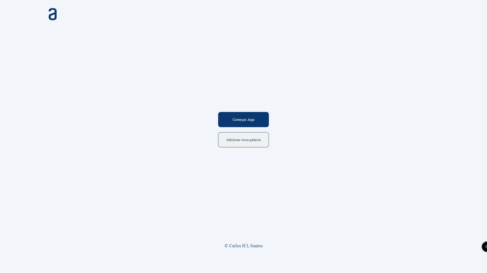
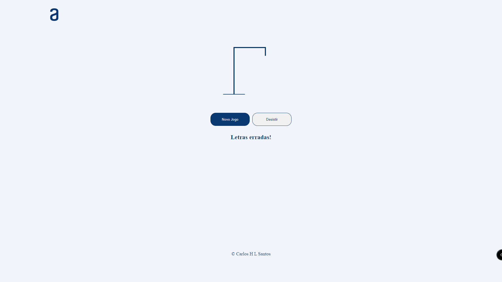
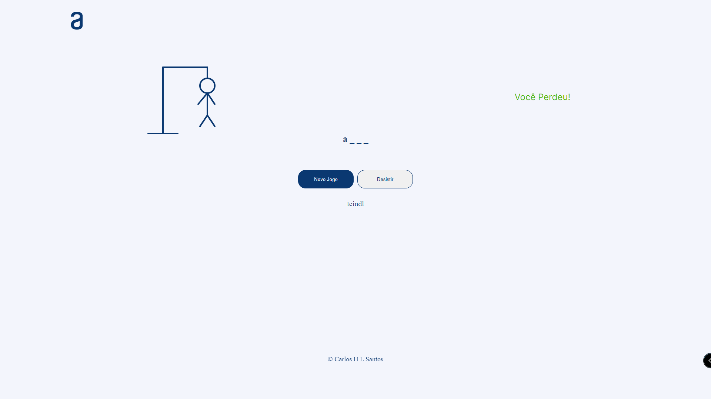
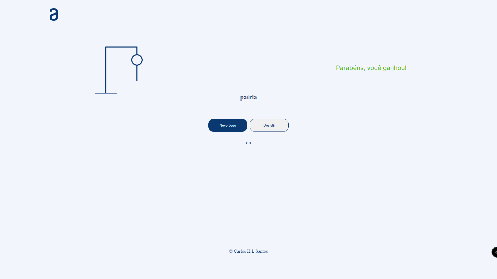
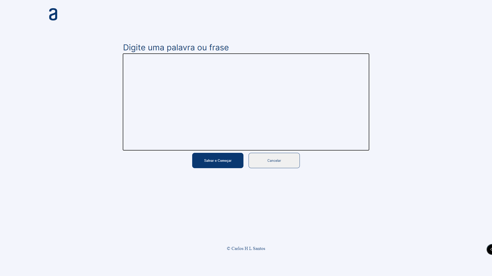

<h1 align="center">Jogo da Forca</h1>

    Este Jogo foi desenvolvido para atender a proposta do curso One da Oracle em parceria com a Alura Cursos.
    Com este projeto foi possível praticar todo conhecimento que foi aprendido durantes os modulos
    de Programação 1 e 2 e nos modulos de HTML e CSS.
    O jogo ainda esta em desenvolvimento, porém encotra-se em fazer de correção de alguns bugs para serem corrigido

## Imagens do Jogo

